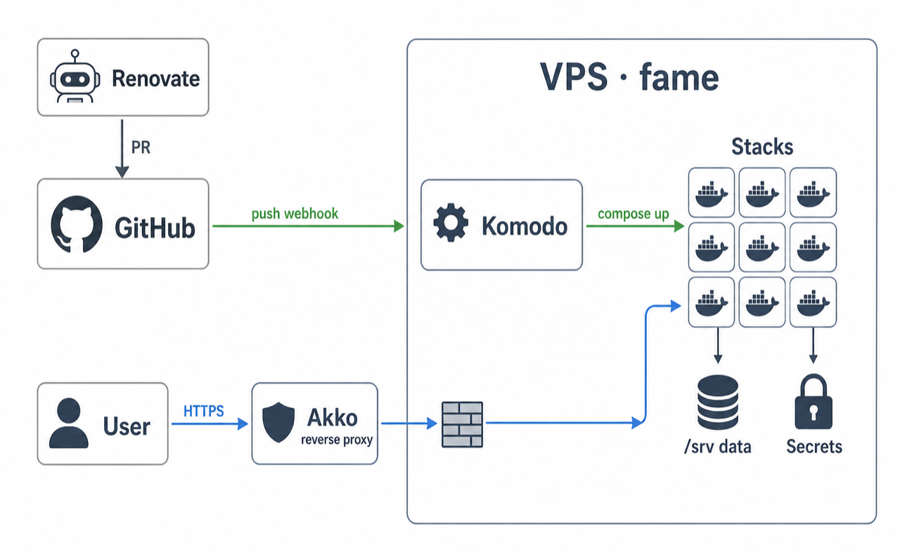

# homelab-infra

[](https://github.com/synthpop123/homelab-infra/actions/workflows/lint.yml)

GitOps for self-hosted services managed by [Komodo](https://komo.do). Each service is a Docker
Compose **Stack** with **pinned** image versions, updated automatically via
[Renovate](https://docs.renovatebot.com) pull requests.



## How it works

**Merging is deploying.** A push to `main` fires one webhook into Komodo on the VPS, which
first reconciles stack *definitions* from [`komodo/sync.toml`](./komodo/sync.toml), then
`docker compose up`s only the stacks whose compose files changed. There is no CI in the
deploy path — the only gate is a lint workflow on relevant infrastructure PRs (`yamllint` +
`docker compose config` + bootstrap shell syntax, runnable locally as `./scripts/validate.sh`). Renovate watches every pinned
`image:` tag and opens bump PRs, so routine updates are review-and-merge.
Details: [workflow.md](./docs/workflow.md).

## Layout

```
.
├── stacks/<service>/compose.yaml   # one folder per service: pinned image, /srv binds, host port
├── komodo/sync.toml                # Komodo Resource Sync + redeploy Procedure (IaC)
├── bootstrap/komodo/               # Komodo itself (Core/Periphery/Mongo): deployed by hand
├── bootstrap/firewall/             # host firewall (DOCKER-USER rules): deployed by hand
├── bootstrap/fail2ban/             # sshd brute-force jail: deployed by hand
├── renovate.json                   # Renovate config (auto-detects stacks/*/compose.yaml)
├── scripts/validate.sh             # pre-deploy lint (stacks/bootstrap/Komodo/Renovate)
├── .github/workflows/lint.yml      # runs validate.sh on infra PRs (no VPS access)
└── docs/                           # conventions, host/ops/media docs, runbooks
```

## Services

Every fame service is reached as `https://<name>.lkwplus.com` through the Akko reverse
proxy; the host ports below are not directly reachable from the internet (see
[Networking](#networking--security)). Services on the arm host are served directly by
arm's own host Caddy (DNS points at arm, no Akko hop), with ports bound to loopback.

| Service | URL | Port | Description |
|---------|-----|------|-------------|
| [wallos](./stacks/wallos) | [wallos.lkwplus.com](https://wallos.lkwplus.com) | 20000 | Subscription tracker |
| [calibre-web-automated](./stacks/calibre-web-automated) | [calibre.lkwplus.com](https://calibre.lkwplus.com) | 20001 | Ebook library (CWA) |
| [deeix-chat](./stacks/deeix-chat) | [ai.lkwplus.com](https://ai.lkwplus.com) | 20002 | AI chat (app + Postgres + Redis) |
| [drizzle-gateway](./stacks/drizzle-gateway) | [db.lkwplus.com](https://db.lkwplus.com) | 20003 | Drizzle Gateway (DB studio) |
| [cloudreve](./stacks/cloudreve) | [cloud.lkwplus.com](https://cloud.lkwplus.com) | 20004 | Cloudreve cloud storage (+ Postgres + Redis) |
| [koito](./stacks/koito) | [music.lkwplus.com](https://music.lkwplus.com) | 20005 / 20006 | Koito scrobble server + multi-scrobbler |
| [new-api](./stacks/new-api) | [api.lkwplus.com](https://api.lkwplus.com) | 20007 | LLM API gateway (app + Postgres + Redis) |
| [opengist](./stacks/opengist) | [gist.lkwplus.com](https://gist.lkwplus.com) | 20008 | Git-powered pastebin |
| [mastodon](./stacks/mastodon) | [mastodon.lkwplus.com](https://mastodon.lkwplus.com) | 20009 / 20010 | Fediverse server (web + streaming + sidekiq + Postgres/Redis/ES) |
| [beszel](./stacks/beszel) | [beszel.lkwplus.com](https://beszel.lkwplus.com) | 20011 | Server monitoring (hub + agent) |
| [immich](./stacks/immich) | [immich.lkwplus.com](https://immich.lkwplus.com) | 20012 | Photo/video backup (server + ML + Postgres/Valkey) |
| [karakeep](./stacks/karakeep) | [karakeep.lkwplus.com](https://karakeep.lkwplus.com) | 20013 | Bookmarks (web + Chrome + Meilisearch) |
| [clouddrive2](./stacks/clouddrive2) | [cd.lkwplus.com](https://cd.lkwplus.com) | host | Cloud storage → FUSE mount (host net) |
| [n8n](./stacks/n8n) | [n8n.lkwplus.com](https://n8n.lkwplus.com) | 20014 | Workflow automation (+ dedicated Postgres) |
| [memos](./stacks/memos) | [memos.lkwplus.com](https://memos.lkwplus.com) | 20015 | Notes (+ dedicated Postgres) |
| [seerr](./stacks/seerr) | [seerr.lkwplus.com](https://seerr.lkwplus.com) | 20016 | Media requests (+ dedicated Postgres) |
| [openwebui](./stacks/openwebui) | [chat.lkwplus.com](https://chat.lkwplus.com) | 20017 | LLM chat UI (+ dedicated Postgres) |
| [gitea](./stacks/gitea) | [git.lkwplus.com](https://git.lkwplus.com) | 20018 | Git hosting (+ dedicated Postgres; SSH on 222) |
| [torrent](./stacks/torrent) | [qb.lkwplus.com](https://qb.lkwplus.com) / [qui.lkwplus.com](https://qui.lkwplus.com) | 20019 / 20020 | qBittorrent + qui WebUI manager (BT on 65231) |
| [emby](./stacks/emby) | [emby.lkwplus.com](https://emby.lkwplus.com) | 20021 | Emby media server (fixed IP 172.22.0.4 on mediacenter-net) |
| [cms](./stacks/cms) | [cms.lkwplus.com](https://cms.lkwplus.com) / [emby-302.lkwplus.com](https://emby-302.lkwplus.com) | 20022 / 20023 | cloud-media-sync — web UI + strm-302 proxy (fixed IP 172.22.0.5) |
| [mdc](./stacks/mdc) | [mdc.lkwplus.com](https://mdc.lkwplus.com) | 20024 | Movie Data Capture scraper (+ internal flaresolverr) |
| [autobrr](./stacks/autobrr) | [autobrr.lkwplus.com](https://autobrr.lkwplus.com) | 20026 | IRC/RSS release automation (+ TMDB→Telegram notify sidecar) |
| [umami](./stacks/umami) | [umami.lkwplus.com](https://umami.lkwplus.com) | 20027 | Privacy-focused web analytics (+ dedicated Postgres) |
| [bark](./stacks/bark) | [bark.lkwplus.com](https://bark.lkwplus.com) | 20028 | Bark push notification server |
| [cliproxyapi](./stacks/cliproxyapi) | [cpa.lkwplus.com](https://cpa.lkwplus.com) / [cpa-manager.lkwplus.com](https://cpa-manager.lkwplus.com) | 20029 / 20030 | CLIProxyAPI AI proxy (CPA) + CPA-Manager-Plus panel |
| [plex](./stacks/plex) | [plex.lkwplus.com](https://plex.lkwplus.com) / [tautulli.lkwplus.com](https://tautulli.lkwplus.com) | 20031 / 20033 | Plex media server (fixed IP 172.22.0.7) + Tautulli Plex monitor (172.22.0.9) + Kometa metadata/collections + letterboxd-plex-sync (weekly Letterboxd → Plex) |
| [medialinker](./stacks/medialinker) | [plex.lkwplus.com](https://plex.lkwplus.com) | 20032 | strm 302 reverse proxy in front of Plex for direct play (fixed IP 172.22.0.8) |
| [multica](./stacks/multica) | [multica.lkwplus.com](https://multica.lkwplus.com) | arm 20000 / 20001 | Multica self-host — AI-agent issue tracker (backend + web + Postgres; **runs on arm**, served by arm's host Caddy) |
| [beszel-agent](./stacks/beszel-agent) | — | arm, host net | Beszel metrics agent (**runs on arm**, reports straight to the beszel hub on fame) |

## Conventions

App images pin an exact version (Renovate's food); databases pin their major line
(`postgres:18-alpine`, `redis:7`) so majors — which need a data migration — arrive as one
deliberate PR. All persistent data sits in absolute bind mounts under `/srv/<service>/`,
outside Komodo's git clone. Host ports are allocated sequentially from `20000`
([the registry](./docs/ports.md) is the single source of truth), and each stack names its
default network after itself. Full rules: [conventions.md](./docs/conventions.md).

## Secrets

Git never holds a secret — composes reference `${VAR}`, `sync.toml` maps `VAR = [[VAR]]`,
and Komodo interpolates the real value from its **Variables** store into a git-ignored
`.env` at deploy time. Whole secret-bearing config files live on the host under
`/srv/<service>/` with a sanitized `*.example` committed instead. Creating and inspecting
the values (UI, or headless via Mongo): [komodo-variables.md](./docs/komodo-variables.md).

## Networking & security

Only Caddy (80/443), sshd, and three deliberate exceptions (gitea SSH, BitTorrent,
beszel hub) face the internet. Every other published port answers **only to the Akko
reverse proxy**, enforced in Docker's `DOCKER-USER` iptables chain — designed so a bad rule
can never lock SSH out ([firewall.md](./docs/firewall.md)). The arm host runs the same
design as a deny-by-default variant; its stacks bind to loopback and are fronted by arm's
own host Caddy (80/443), so no container port is internet-reachable there either. sshd on
both hosts sits behind fail2ban ([bootstrap/fail2ban](./bootstrap/fail2ban/)).

## Media pipeline

The most intertwined subsystem: clouddrive2 FUSE-mounts a 115 netdisk, cms turns it into a
`.strm` library that Emby and Plex share, mdc scrapes metadata into it, and playback is a
302-redirect straight to the cloud — media bytes never transit the VPS. Plex needs a
helper proxy (medialinker) for that trick; seerr, tautulli and kometa orbit around.
Topology, fixed IPs, and failure modes: [media.md](./docs/media.md).

## Hosts & operations

Most stacks run on one Debian 12 VPS (**fame**, 6 vCPU / 24 GiB), which also hosts
the Komodo Core. A second host — **arm** (Oracle Cloud Chuncheon, 2 vCPU aarch64 / 12 GiB)
— is connected to the same control plane via an outbound Periphery agent and runs its
first stack (multica); declaring a stack with `server = "Oracle-Arm"` in `sync.toml` is
all it takes to target it (arm64 images only). How servers join Komodo: [komodo-servers.md](./docs/komodo-servers.md).
Three things are managed by hand outside Komodo, versioned under
[`bootstrap/`](./bootstrap/): Komodo itself, the host firewalls, and fail2ban (the latter
two on both hosts). Host inventories
and known state: [server.md](./docs/server.md) (fame), [server-arm.md](./docs/server-arm.md)
(arm). Health checks, `km` CLI, "my push didn't deploy", reboot/housekeeping runbooks:
[operations.md](./docs/operations.md).

## Backup

Komodo's own database (definitions, secrets) dumps itself daily on-box; the repo is its own
off-site copy for code. The known gap is `/srv` application data + off-site shipping — the
plan and restore runbooks (single service through bare-metal rebuild) are in
[backup-restore.md](./docs/backup-restore.md).

## Add a service

One commit, four places:

1. `stacks/<service>/compose.yaml` — pin the image, volumes under `/srv/<service>/…`,
   next free port from [docs/ports.md](./docs/ports.md).
2. [`komodo/sync.toml`](./komodo/sync.toml) — add the `[[stack]]` block (+ `[[VAR]]` mappings
   for any secrets).
3. [`docs/ports.md`](./docs/ports.md) — record the port, bump **Next free**.
4. This README — add the service row above.

Push — the `Redeploy On Push` procedure syncs the definition and deploys it in one ordered
run; a brand-new stack comes up on its first push ([workflow.md](./docs/workflow.md)).
Adopting something that already runs elsewhere (data move, secrets, cutover) has its own
runbook: [migration.md](./docs/migration.md).

## License

[MIT](./LICENSE)
